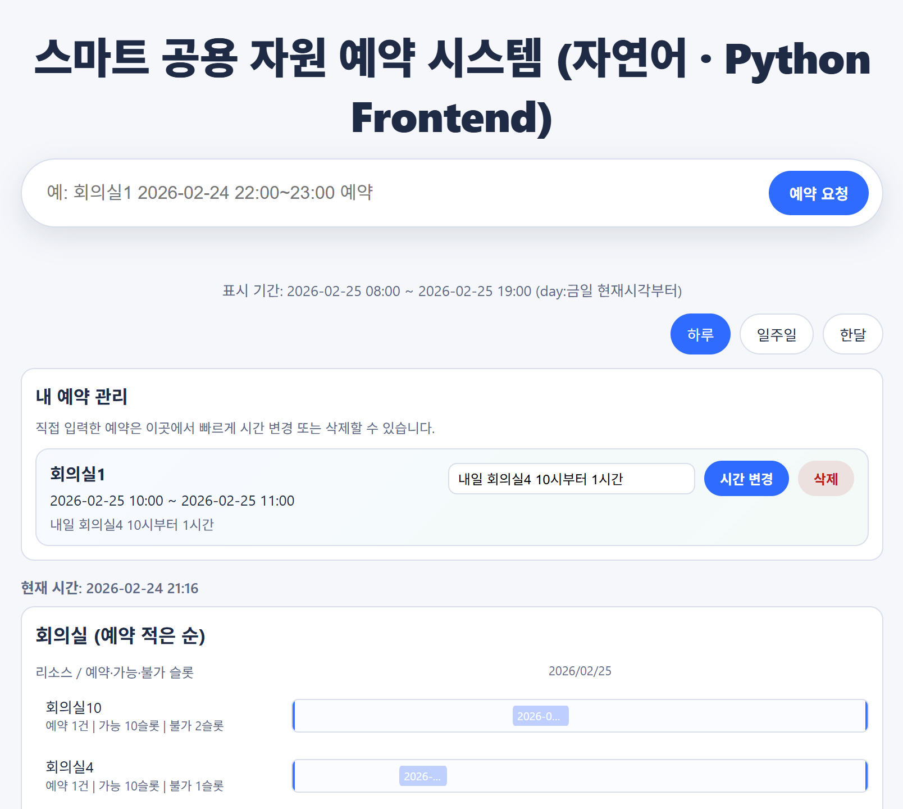

# Reservation Manager

[](https://codespaces.new/mirrormesh/reservation_manager)
[](https://github.com/mirrormesh/reservation_manager)

> 평가/데모 시 로컬 설치 없이 웹 브라우저에서 바로 VS Code 개발 환경을 열어 실행할 수 있습니다.

YAML 기반 자원 예약 시스템입니다. 회의실(10개)과 테스트단말기(20개)를 자연어로 예약하고, 웹 UI에서 기간별(하루/일주일/한달) 현황을 확인할 수 있습니다.

본 과제에서는 Python과 Node.js를 의도적으로 동시에 구현했습니다. 목적은 “AI 기반 개발에서 다중 언어 병행 구현이 실제로 정합성/유지보수성 측면에서 어느 수준까지 가능한지”를 검증하는 것이었습니다.



## 과제 시사점

- **AI 생산성 덕분에 Python/Node.js 동시 구현 자체는 과거보다 현실적으로 수행 가능**했습니다.
- 다만 구현/검증 범위가 2배로 늘어나면서, **AI 사용 리소스(프롬프트/반복 수정)와 총 소요 시간은 단일 언어 대비 더 많이 소요**되었습니다.
- 과거 경험처럼 개발자가 언어별로 분리 개발할 때 발생하던 비효율(정합성 불일치, 중복 수정, 테스트 분산)은 **여전히 유효한 리스크**였습니다.
- 이번 결과는 **“다중 언어 병행 개발은 가능하지만, 자동화된 테스트·공통 정책·동일 UI 검증 체계가 전제되어야 유지보수 가능하다”**는 판단을 뒷받침합니다.

## 핵심 정책

- 예약은 현재 시점 기준 30일 이내만 허용
- 업무시간은 08:00~19:00
- 주말 + 공휴일 예약 불가
- 동일 자원 겹침 예약 불가 (`[start, end)` 기준)
- 당일 예약 요청 시 종료시간이 19:00을 넘으면 자동으로 19:00까지 보정
- 입력 시간은 자유 형식으로 받아도 저장 시 10분 단위로 자동 보정
	- 시작: 10분 단위 버림
	- 종료: 10분 단위 올림
- 회피 대안은 최대 3개 제안 후 사용자 선택(자동 확정 없음)
- 대체 자원은 같은 자원군만 허용(회의실↔회의실, 단말기↔단말기)

## 저장 구조

- 활성 예약: `data/active_reservations.yaml`
- 마감 예약: `data/closed_reservations.yaml`
- 이벤트 로그: `data/reservation_events.yaml`

주요 이벤트:

- `RESERVATION_CREATED`
- `RESERVATION_UPDATED`
- `RESERVATION_CLOSED`
- `TEST_DATA_GENERATED`
- `TEST_DATA_GENERATED_SPECIFIC_RESOURCE`
- `TEST_DATA_GENERATED_LARGE`
- `YAML_RECOVERED`

## UI 기능 요약

- Google 스타일 검색형 입력창
- 기본 기간: `하루`
- 기간 전환: `하루 / 일주일 / 한달`
- 좌측 회의실 / 우측 테스트단말기 2패널
- 예약 적은 순 정렬
- 타임라인 경계선 + 날짜 라벨(중복 최소화)
- 0 슬롯 항목 숨김(가능/불가 슬롯 각각)
- 예약 바 마우스오버 툴팁(요청문/시간)
- 입력창 예시 시간 자동 갱신: 현재 기준 다음 정시~1시간
- 리소스 테이블 상단 좌측 현재 시간 표시
- 예약 성공 시 공지용 `결과 카드` 즉시 표시

## 테스트 데이터 성격

- 30일 창에서 가까운 날짜일수록 예약 밀도 높음
- 먼 날짜로 갈수록 예약 밀도 낮음
- 당일 포함 초기 구간은 상대적으로 혼잡하게 생성
- 시작 시각/분 단위 분산으로 동일 시각 쏠림 완화
- 리소스도 균등 분포 대신 가중치 기반 핫스팟 분포

## 실행 방법

### 1) Windows 원클릭 검증

```bat
run_windows_first_run.bat check
```

자동 수행:

1. Python 확인
2. `.venv` 생성
3. 의존성 설치
4. Python 테스트
5. Node 테스트
6. 기능 시나리오 점검

### 2) Windows UI 실행 (Python + Node.js)

Python UI 실행:

```bat
run_windows_python.bat [setup|test|server|all]
```

- 기본값 `all`: Python 3 자동 감지/설치 → `.venv` 구성 → `pip install` → 샘플 데이터 보정 → `python -m unittest discover -s tests -v` 실행 후 Flask UI 서버 및 브라우저 자동 오픈
- `setup`: 환경 준비/샘플 데이터 생성까지만 수행(테스트/서버 생략)
- `test`: 준비된 환경에서 Python 단위 테스트만 실행
- `server`: 기존 준비 상태를 신뢰하고 UI 서버만 즉시 실행 (주소 `http://127.0.0.1:5000`)

Node.js UI 실행:

```bat
run_windows_node.bat [setup|test|server|all]
```

- 기본값 `all`: 휴대용 Node.js(v20.12.2) 자동 설치 → Python 백엔드 준비(`run_windows_python setup`) → Python·Node 테스트 순차 실행 → Node API 서버 및 브라우저 오픈 (주소 `http://127.0.0.1:3000`)
- `setup`: Node 런타임 + Python 환경만 구성
- `test`: Python 단위 테스트 후 Node 테스트(`node --test nodejs/test/*.test.js`)까지 수행
- `server`: 준비된 런타임을 사용해 Node API/테스트 페이지만 기동 (엔드포인트 `GET /`, `GET /health`, `GET|POST /parse`, `/api/*`)

교차 조합 테스트(프론트/백 분리):

- Python UI + Node.js Backend
	- Python UI를 연 뒤 아래 주소로 접속:
	- `http://127.0.0.1:5000/?apiBase=http://127.0.0.1:3000`
- Node.js UI + Python Backend
	- Node UI를 연 뒤 아래 주소로 접속:
	- `http://127.0.0.1:3000/?apiBase=http://127.0.0.1:5000`

설명: `apiBase` 쿼리 파라미터로 UI가 호출할 API 백엔드 주소를 지정할 수 있습니다.

### 3) Windows 최초 실행(추천)

```bat
run_windows_first_run.bat
```

최초 1회 기준으로 아래를 자동 수행합니다.

1. 가상환경 생성/의존성 설치
2. Python/Node 테스트 실행
3. 초기 샘플 데이터 생성
4. UI 서버 실행 및 브라우저 오픈

> 참고: `run_windows_first_run.bat`는 기본값 `first-run` 모드와 `check` 모드를 모두 지원합니다. 구버전 호환을 위해 남겨둔 `run_windows_check.bat`는 내부적으로 `run_windows_first_run.bat check`를 호출합니다.

### 3-1) 통합 스크립트 모드 요약

| 모드 | 실행 명령 | 주요 목적 |
| --- | --- | --- |
| `first-run` (기본) | `run_windows_first_run.bat` | 초기 환경 구성 + 샘플 데이터 생성 + UI 서버 실행 |
| `check` | `run_windows_first_run.bat check` | 기존 원클릭 검증 플로우(테스트/퀵체크) |

> `run_windows_check.bat`를 직접 실행해도 기존 습관대로 사용 가능하지만, 내부적으로 위 표의 `check` 모드를 호출합니다.

### 4) 수동 테스트 실행

```bash
py -m unittest discover -s tests -v
```

```bash
node --test nodejs/test/*.test.js
```

## 주요 코드 위치

- 겹침 판정: `reservation_manager/booking.py`
- 자연어 파싱: `reservation_manager/natural_language.py`
- YAML 저장소/정책/시드데이터: `reservation_manager/yaml_store.py`
- 웹 앱/API: `reservation_manager/web_app.py`
- UI 템플릿: `templates/index.html`
